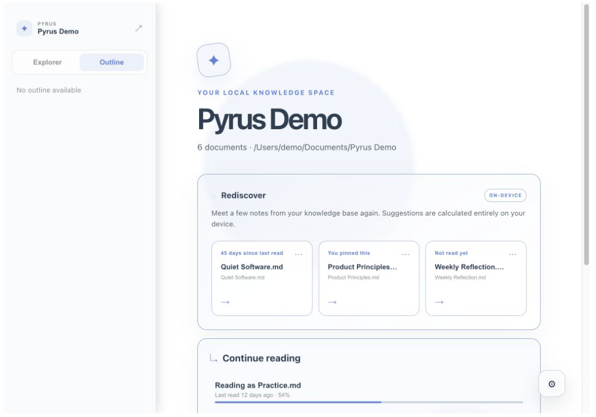
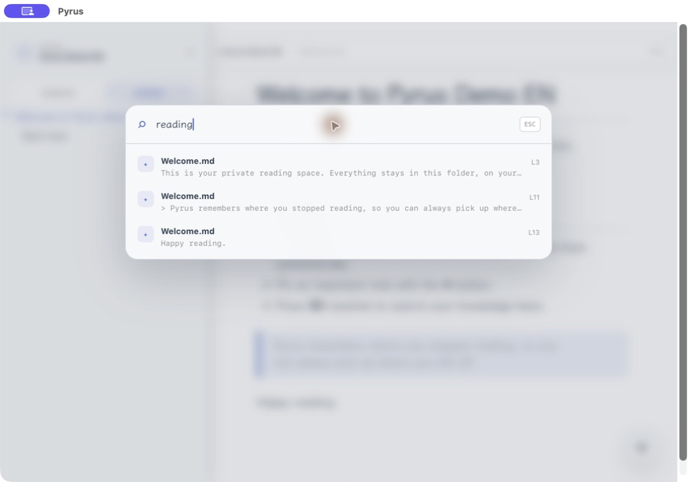
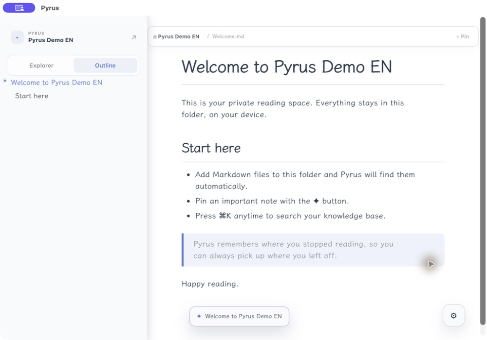
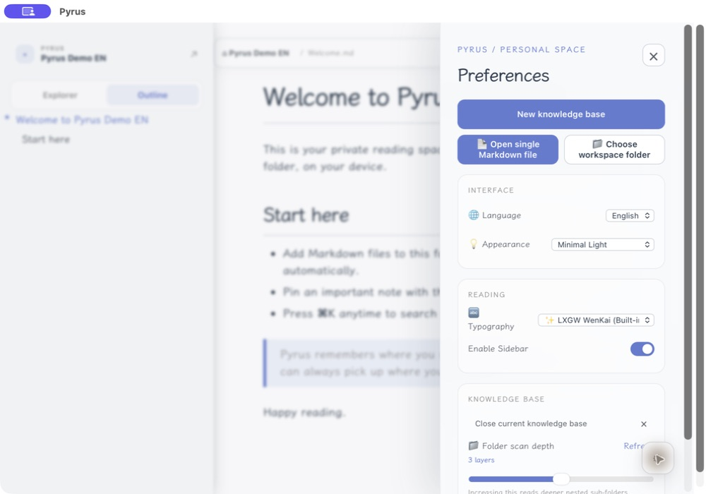

<div align="center">
  
  <h1>Pyrus</h1>
  <p><strong>A calm, local-first reading space that brings forgotten Markdown notes back to you.</strong></p>
  <p><strong>English</strong> · <a href="./README_zh-CN.md">简体中文</a></p>
  <p><a href="https://insight4core.github.io/markdown_reader/en/">Website</a> · <a href="https://github.com/Insight4Core/markdown_reader/releases/latest">Download</a></p>
</div>

## Early Access

Pyrus is free while it grows. It is built for people who already keep notes in Markdown and want a more focused place to read, rediscover, and find them—without accounts, cloud sync, or an editor getting in the way.

## Your notes return when they matter

Writing a note is easy. Remembering that it exists months later is harder.

The knowledge home now opens with **Today's Echo**: one locally selected note, one meaningful passage, and a clear reason it returned. Read it, bring it back tomorrow, hide it, or mark it helpful with one click. Only if you want to, you can add one sentence about how it helped; that context stays on your device with the rest of your reading history.

While you read, **Knowledge Echoes** quietly finds an older note connected to the page in front of you. It shows the passage that made the connection, the shared ideas, and why the note has returned—perhaps because you pinned it or have not read it for months.

Open the note, move to the next echo, bring it back later, or mark it as unrelated. Pyrus remembers useful feedback and combines it with pins and reading history. The knowledge home still brings back unread and long-unvisited notes when you want a broader rediscovery moment.

Every connection is calculated entirely on your device. Pyrus does not upload or inspect your knowledge base through an external service.

## Preview

| Rediscover forgotten notes | Find anything with `⌘K` |
| --- | --- |
|  |  |

| Continue reading | Preferences |
| --- | --- |
|  |  |

## What makes it useful

- **Meet one note again today** — Today's Echo brings back one unread, pinned, or long-unvisited note with a meaningful passage instead of another recommendation feed.
- **Remember why it helped** — Mark an echo as useful and optionally leave one sentence about what it helped you understand today.
- **Meet knowledge in context** — Knowledge Echoes surfaces a related old note while you read, with a relevant excerpt and shared themes.
- **Local knowledge spaces** — Open an existing folder or create a new knowledge base with a ready-to-read `Welcome.md`.
- **Pick up where you stopped** — Pyrus saves your reading position for every document and surfaces it on the knowledge home.
- **Pin what matters** — Keep essential notes one click away.
- **Find knowledge instantly** — Press `⌘K` on macOS or `Ctrl+K` elsewhere to search file names and document content, then jump to the matching passage.
- **Read long documents with context** — A live outline follows your position in the document, alongside a subtle reading-progress indicator.
- **Private by default** — Notes, pins, recents, progress, echo feedback, and rediscovery preferences stay on your device.

## Getting started

1. Launch Pyrus.
2. Select **New knowledge base** to create a folder and a starter note, or choose **Open knowledge base** to use an existing Markdown folder.
3. Return to the knowledge home to rediscover notes, use the Explorer and Outline to navigate, or press `⌘K` / `Ctrl+K` to search the whole knowledge base.

## Download

Download the latest macOS, Windows, or Linux build from [GitHub Releases](https://github.com/Insight4Core/markdown_reader/releases/latest).

## Feedback

Pyrus is shaped by early readers. Use **Send feedback** in Preferences, or open a [GitHub issue](https://github.com/Insight4Core/markdown_reader/issues) to share an idea or report a problem.

## Development

Requirements: Node.js, Rust, and the platform prerequisites for Tauri.

```bash
git clone https://github.com/Insight4Core/markdown_reader.git
cd markdown_reader
npm install
npm run tauri dev
```

## License

MIT
