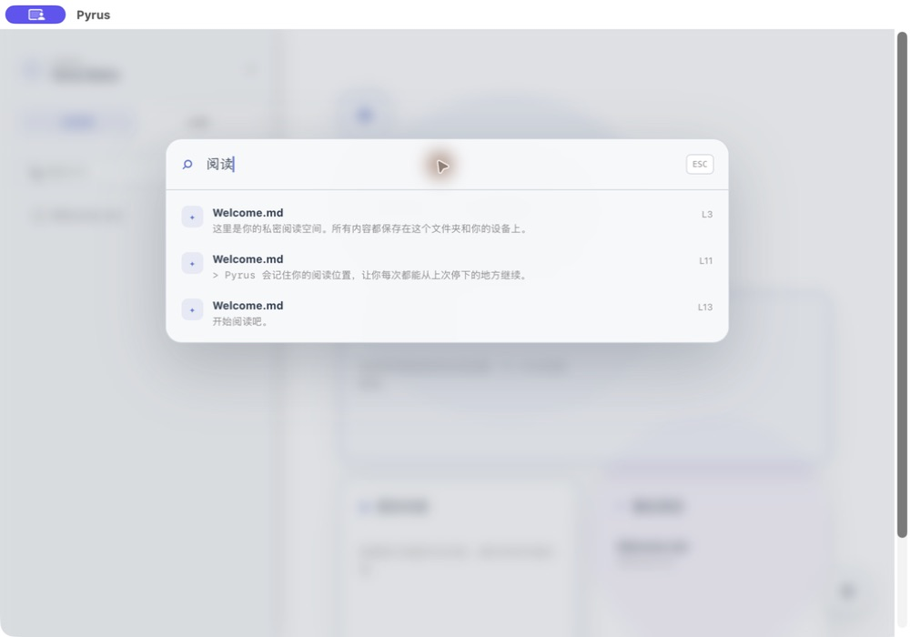
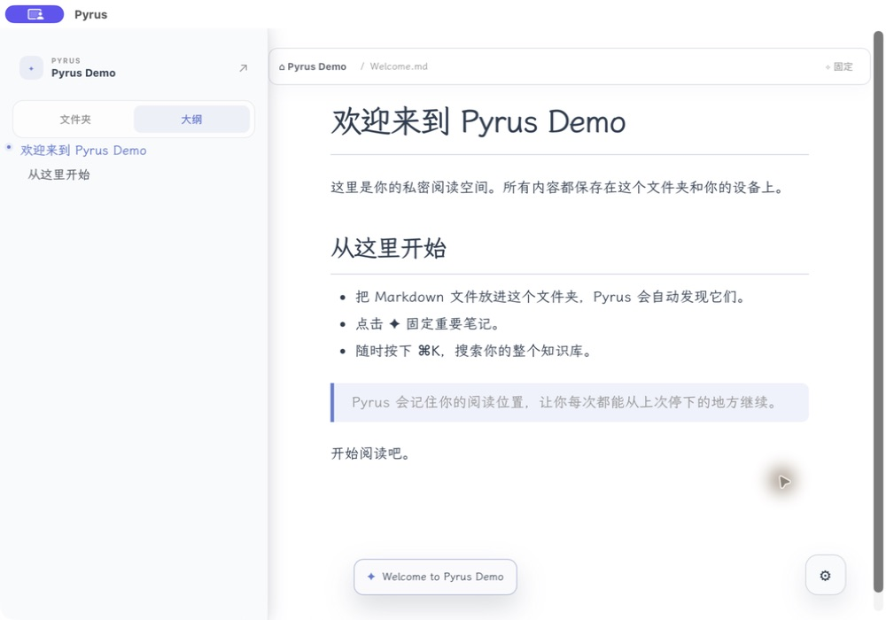

<div align="center">
  
  <h1>Pyrus</h1>
  <p><strong>一个安静、本地优先的 Markdown 知识库阅读空间。</strong></p>
  <p><a href="./README.md">English</a> · <strong>简体中文</strong></p>
</div>

## 早期体验版

Pyrus 在成长阶段保持免费。它服务于已经用 Markdown 记录内容的人：提供一个更专注的地方阅读、回顾和找回知识，而不要求账户、云同步，也不把编辑器塞到你的面前。

## 产品预览

| 开始一个知识库 | 使用 `⌘K` 找回知识 |
| --- | --- |
|  |  |

| 继续阅读 | 偏好设置 |
| --- | --- |
|  |  |

## 它解决了什么

- **本地知识空间**：打开已有文件夹，或新建一个带 `Welcome.md` 的知识库。
- **从上次停下的地方继续**：Pyrus 为每篇文章保存阅读位置，并在知识库首页优先展示。
- **固定重要内容**：将关键笔记固定，一键回到它们。
- **快速找回知识**：按下 `⌘K`（Windows/Linux 使用 `Ctrl+K`）搜索文件名和正文，并直接跳到匹配段落。
- **带着上下文阅读长文**：大纲会随滚动自动标记当前章节，顶部细进度线提示阅读进度。
- **默认私密**：笔记、固定内容、最近阅读和进度都只保存在你的设备上。

## 开始使用

1. 启动 Pyrus。
2. 选择「新建知识库」创建文件夹和示例笔记，或选择「打开知识库」使用已有的 Markdown 文件夹。
3. 用文件浏览器查看内容、用大纲定位章节，并通过 `⌘K` / `Ctrl+K` 搜索整个知识库。

## 下载

预发行版本将发布在 [Releases](https://github.com/Insight4Core/markdown_reader/releases) 页面。

## 反馈

Pyrus 由早期读者共同塑造。请在设置页使用「发送反馈」，或前往 [GitHub Issues](https://github.com/Insight4Core/markdown_reader/issues) 提交建议与问题。

## 本地开发

需要 Node.js、Rust 以及 Tauri 对应平台的构建环境。

```bash
git clone https://github.com/Insight4Core/markdown_reader.git
cd markdown_reader
npm install
npm run tauri dev
```

## 许可证

MIT
