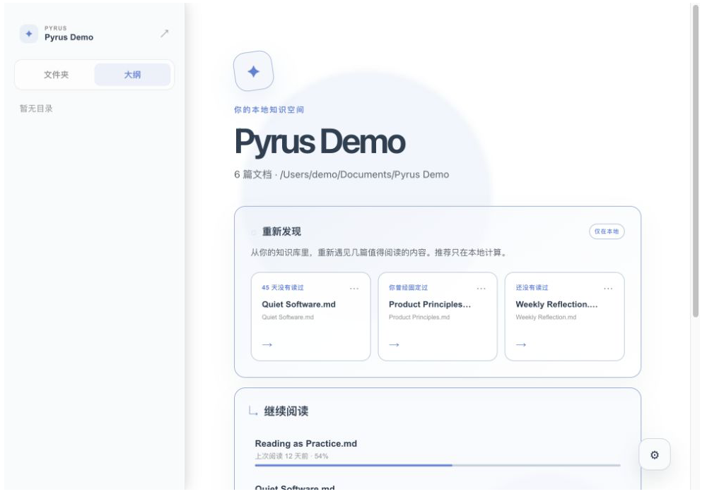
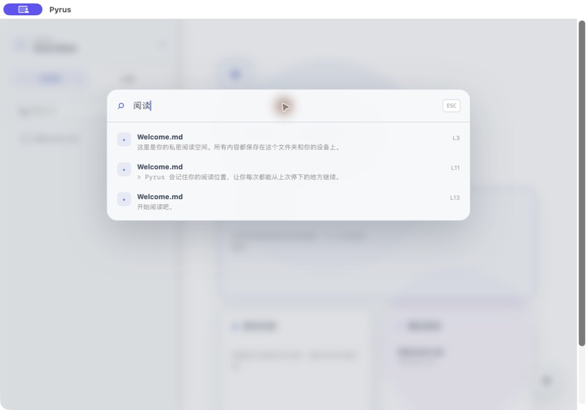
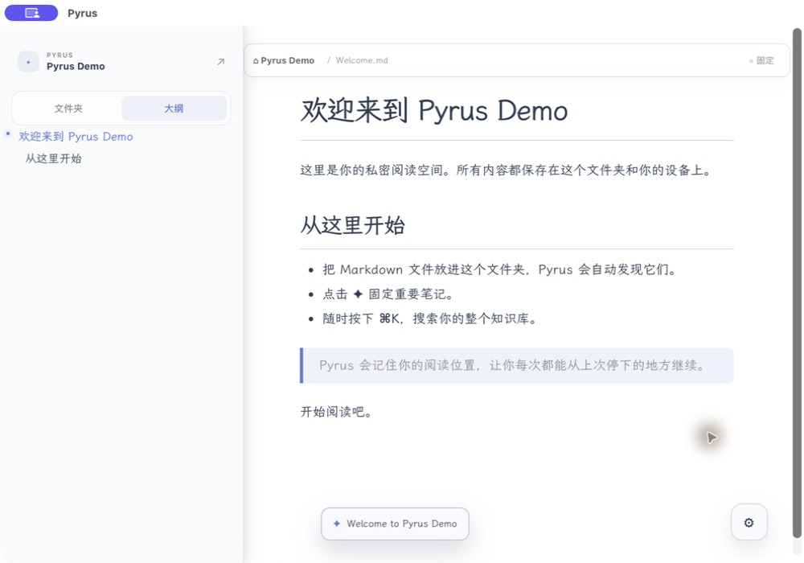

<div align="center">
  
  <h1>知返</h1>
  <p><strong>一个让被遗忘的本地 Markdown 笔记重新回到你面前的阅读空间。</strong></p>
  <p><a href="./README.md">English</a> · <strong>简体中文</strong></p>
  <p><a href="https://insight4core.github.io/markdown_reader/zh-cn/">官方网站</a> · <a href="https://github.com/Insight4Core/markdown_reader/releases/latest">下载</a></p>
</div>

## 早期体验版

知返在成长阶段保持免费。它服务于已经用 Markdown 记录内容的人：提供一个更专注的地方阅读、重新发现和找回知识，而不要求账户、云同步，也不把编辑器塞到你的面前。

## 让旧知识在需要时重新出现

写下一篇笔记并不难，难的是几个月后还记得它曾经存在。

知识库首页现在会先呈现一条「**今日回响**」：一篇只在本地挑选的旧笔记、一段值得重读的原文，以及它今天回来的原因。你可以读一读、让它明天再来、隐藏它，或一键标记「这条回响有帮助」。只有当你愿意时，才需要再留下一句话，记住它今天具体帮了什么；这些内容与阅读历史一样只保存在你的设备上。

阅读时，**知识回响**会安静地寻找一篇与当前内容相关的旧笔记，展示促成连接的段落、共同主题，以及它为什么在此刻回来——也许你曾经固定过它，也许你已经几个月没有读过它。

你可以打开笔记、切换下一条回响、让它稍后再出现，或标记为不相关。知返会记住有价值的反馈，并结合固定内容和阅读历史调整顺序；知识库首页也会继续带回尚未阅读和长期未打开的内容。

所有关联都只在你的设备上计算。知返不会把知识库上传到外部服务，也不依赖云端分析文档内容。

## 产品预览

| 重新发现旧笔记 | 使用 `⌘K` 找回知识 |
| --- | --- |
|  |  |

| 继续阅读 | 偏好设置 |
| --- | --- |
|  |  |

## 它解决了什么

- **今天重遇一篇笔记**：「今日回响」每天带回一篇尚未阅读、曾经固定或很久没有打开的内容，并呈现一段值得重读的原文。
- **记住它为什么有用**：标记「它今天帮到了我」，还可以留下一句话，记录这次重逢带来的新语境。
- **在上下文中重遇知识**：阅读时通过「知识回响」带回相关旧笔记，并展示关联段落和共同主题。
- **本地知识空间**：打开已有文件夹，或新建一个带 `Welcome.md` 的知识库。
- **从上次停下的地方继续**：知返为每篇文章保存阅读位置，并在知识库首页优先展示。
- **固定重要内容**：将关键笔记固定，一键回到它们。
- **快速找回知识**：按下 `⌘K`（Windows/Linux 使用 `Ctrl+K`）搜索文件名和正文，并直接跳到匹配段落。
- **带着上下文阅读长文**：大纲会随滚动自动标记当前章节，顶部细进度线提示阅读进度。
- **默认私密**：笔记、固定内容、最近阅读、阅读进度、回响反馈和重新发现偏好都只保存在你的设备上。

## 开始使用

1. 启动知返。
2. 选择「新建知识库」创建文件夹和示例笔记，或选择「打开知识库」使用已有的 Markdown 文件夹。
3. 回到知识库首页重新发现笔记，用文件浏览器和大纲定位内容，或通过 `⌘K` / `Ctrl+K` 搜索整个知识库。

## 下载

前往 [GitHub Releases](https://github.com/Insight4Core/markdown_reader/releases/latest) 下载最新的 macOS、Windows 或 Linux 版本。

## 反馈

知返由早期读者共同塑造。请在设置页使用「发送反馈」，或前往 [GitHub Issues](https://github.com/Insight4Core/markdown_reader/issues) 提交建议与问题。

## 本地开发

需要 Node.js、Rust 以及 Tauri 对应平台的构建环境。

```bash
git clone https://github.com/Insight4Core/markdown_reader.git
cd markdown_reader
npm install
npm run tauri dev
```

## 许可证

MIT
